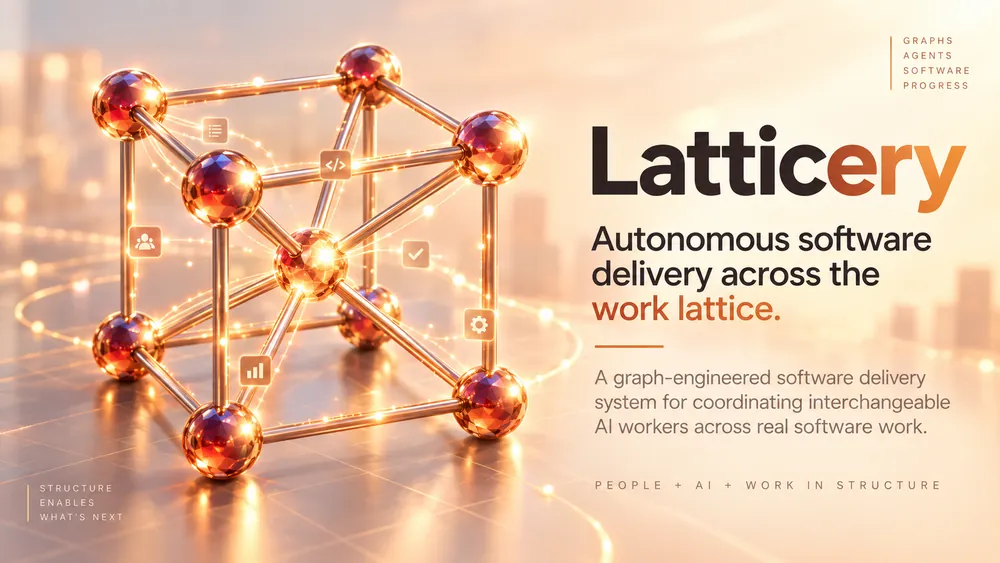

# Latticery

**Autonomous software delivery across the work lattice.**

Latticery is a graph-engineered software delivery system for coordinating interchangeable AI workers across real software work.

The durable thing is not an agent session. It is the **work lattice**: dependencies, leases, implementation, review, verification gates, recovery paths, and explicit human boundaries. Workers enter that lattice, perform bounded work, leave durable state behind, and can be replaced without losing the system's understanding of what comes next.

> The graph persists. The workers orbit through it.

## Why Latticery?

Most coding-agent systems focus on making one agent loop better. Latticery focuses on the larger coordination problem:

- What work is executable now?
- What is blocked by dependencies or human action?
- Which worker may claim it?
- When should implementation yield to review or repair?
- How do we prevent duplicate work?
- What evidence makes a change ready to advance?
- What happens when a worker disappears halfway through?
- How does the system keep moving without allowing automation to outrun its boundaries?

Individual workers still operate in loops. Latticery coordinates the graph those loops move through.

## Core vocabulary

- **Lattice** — the persistent graph of work and delivery state.
- **Node** — a unit of work or state in the lattice.
- **Edge** — a dependency or progression relationship between nodes.
- **Worker** — an interchangeable executor operating on eligible work.
- **Lease** — temporary ownership of a next action.
- **Gate** — evidence or a condition required before progression.
- **Boundary** — an explicit point where automation must stop for human authority.
- **Recovery path** — a route back to executable state after interruption or failure.

## Design principles

1. **Persistent graph, replaceable workers.** Correctness cannot depend on one agent remembering what happened.
2. **Dependencies are executable policy.** Work is selected from what is actually unblocked, not merely what looks important.
3. **Leases, not permanent ownership.** Workers temporarily own actions so stalled workers do not monopolize work.
4. **Review is independent work.** Producing a change and judging it are separate responsibilities.
5. **Evidence advances work.** CI, review, exact revision identity, and other gates control progression.
6. **Backpressure is a feature.** The system should slow production when review or verification becomes the bottleneck.
7. **Recovery is part of execution.** Interrupted work must be resumable from durable state.
8. **Humans define the boundary.** Automation stops where policy says human authority begins.
9. **Adapters isolate product assumptions.** Latticery should not require ComicPile-specific conventions to function.

## Origin

Latticery is being extracted from the autonomous software factory developed inside [ComicPile](https://github.com/JoshCLWren/comic-pile). The extraction is intentionally architectural rather than a wholesale code copy: generic coordination primitives belong here; application-specific policy remains behind adapters.

## Status

**Early extraction.** The existing system is proven inside ComicPile, but the standalone Latticery API and package boundaries are being defined now. Expect interfaces to move while the generic runtime is separated from its first host application.

See [Architecture](docs/architecture.md) and the [Extraction Roadmap](docs/extraction-roadmap.md).
